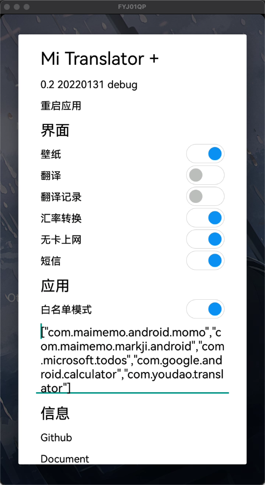
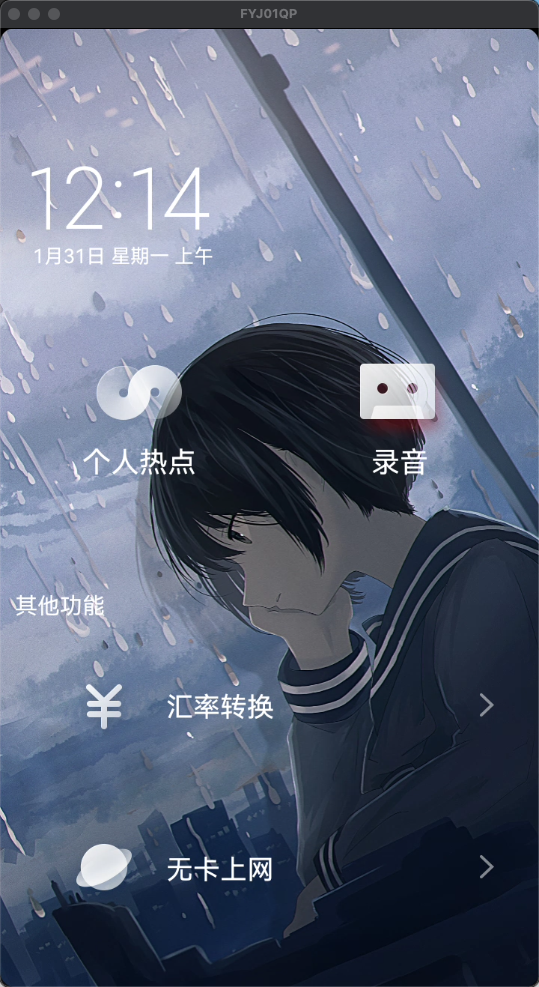
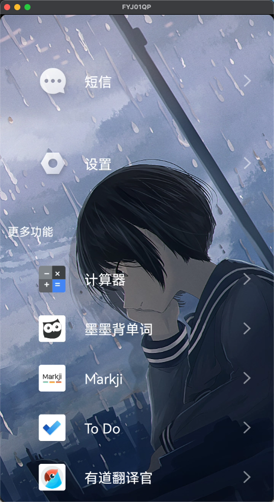

# Mi Translator +

Enhance mi translator experience.

## Usage

- [Unlock your translator and install magisk.](https://www.coolapk.com/feed/27332182?shareKey=MzA0ZWY0N2QzZmUxNjFmNzg4ODg~)

- [Install xposed.](https://lsposed.org)

- [Install and enable this module.](https://modules.lsposed.org/module/moe.lz233.mitranslator)

- Long Press text clock to open setting dialog.

## Screenshot

|  ||
| :----------------------------------------------------------: | ---- |
|                       |      |

## Credit

[BiliRoaming](https://github.com/yujincheng08/BiliRoaming/blob/master/LICENSE)

[FuckCoolapk](https://github.com/ejiaogl/FuckCoolapk/blob/master/LICENSE)

[MiuiHome](https://github.com/qqlittleice/MiuiHome/blob/main/LICENSE)
